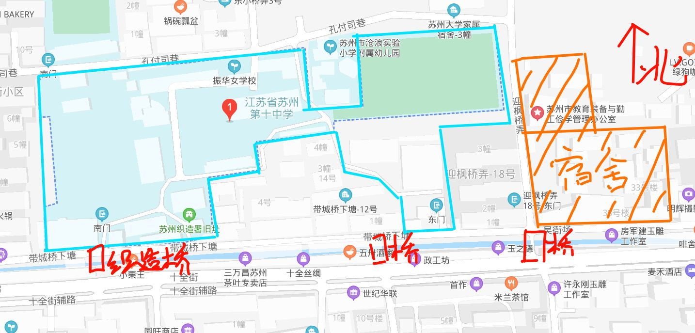

# 苏州十中 宿舍指南 v2020

## 写在前面：

如果你需要住宿，而且家离得比较远，请在8.2日报道的时候（也就是新生第一次报道的时候和老师说）

注意，这个宿舍指南只是前几年的经验之谈，而且只针对本部，请以实际情况为准。

我校于2018年秋季开学开始提供住宿。住宿确实能给学生带来极大的方便，但是否与学生的学习成绩有关这是因人而异的。据老师所说，我校10年前也曾开办过宿舍，而且毕业生平均成绩高于走读生。

> _目录_
> * [一、宿舍概况](#1)
>   * [1.地理位置](#1.1)
>   * [2.宿舍内部](#1.2)
> * [二、住宿生须知](#2)
>   * [1.入住需要准备的](#2.1)
>   * [2.关于手机](#2.2)
>   * [3.床位是怎么分配的](#2.3)
>   * [4.洗衣机以及烘干机](#2.4)
>   * [5.入住和退宿](#2.5)
> * [三、住宿生的晚自习](#3)

<h2 id="1">一、宿舍概况</h2>

<h3 id="1.1">1. 地理位置</h3>

> 宿舍在图示位置，就在学校边上，上下学不会走很久。  
> 上下学的话最近的应该是东南门。  
> 可以从 _三元坊_ 或者 _临顿路_ 地铁站出来，然后走过去。    
或者坐公交车到 _网师园北_  然后往东走一段可以看见有一个小桥，过去可以直接看到宿舍门。  
💡_注意十全街4:30以后汽车单行_（好像，反正注意不要被罚款）

  
<h3 id="1.2">2.宿舍内部</h3>

宿舍为6床，可以开空调，有窗户，床铺为上下铺。有独立卫生间和独立淋浴房，有独立的带锁柜子，
如图所示☟

宿舍实拍图：

<h2 id="2">二、住宿生须知</h2>

<h3 id="2.1">1.入住需要准备的</h3>

首先，学校可能会让住宿生每人买一套床上用品，虽然不知道是不是强制性的。18年的时候是棉花+被子+枕头+脸盆*2+钢杯+其他东西（忘了
反正我觉得还不如直接从家里带过来呢，如果不是强制的但是我反正不会花小一千来买这样一套，而且经过一个学期以后，咱们基本每个人的床都是不一样的颜色了（虽然之前说是要统一床上用品,但好像也无所谓了）

需要准备的东西

<h3 id="2.2">2.关于手机</h3>

18年开学开始住宿生带手机需要上交，可是自19年开学开始，学生不允许带手机到宿舍。

当然，被抓到就要暂停1个月的住宿，第二次被发现就直接退宿了。

<h3 id="2.3">3.床位是怎么分配的</h3>

床位的分配是按照班级来的，有可能会存在几个班级一起住的情况。
当然啦，同学之间要互相包容和理解，集体生活总是会有种种矛盾，在能包容的范围内互相理解吧！
当然也有同学因为各种事情吵架，甚至会因此退宿。

<h3 id="2.4">4.洗衣机以及烘干机</h3>	
宿舍洗衣房有很多台洗衣机，其中有4台小的，有两台大的
其中两台大的带有烘干按钮，大概要花费大概2小时

晾衣服的话可以在一楼的晾衣服的长廊晾，亦或者在三楼晾，当然，男生去不了3楼qwq

<h3 id="2.5">5.入住和退宿</h3>

住宿生入住时间是每周日晚上5：30之前，退宿时间是每周六上完课之后
如果有临时调休时间会另行通知
大型考试（期中，期末）住宿生可以选择那一周不来住宿，但如果选择住宿，晚自习是一定要上的
如果带手机被发现了，初犯的话暂停1个月住宿，再犯的话会直接退宿
没有正当理由最好不要随便请假，
如果有正当理由需要请假的，需要家长提前1天或者最迟在周日上午（回宿舍之前）向班主任请假，注意一定要 _家长向班主任请假_ ，如果擅自不来住宿，次数多了也会被退宿。

<h2 id="3">三、住宿生的晚自习</h2>

住宿生的晚自习时间上和走读生是一样的，上学期是6：30~7：45和8：00~9：15两节课

当然学校晚自习之后还没写完作业或者是还想再看会书，可以去宿舍大厅自习。

